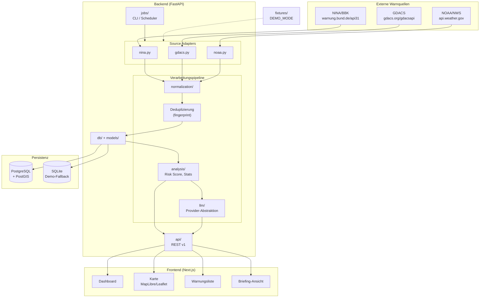

# Architektur — Global Risk Intelligence MVP

> **Status:** Phase 1 Planungsdokument (kein lauffähiger Code)

## Ziel

Das System aggregiert öffentliche Warnmeldungen aus drei Quellen (Deutschland/NINA, GDACS, NOAA/NWS), normalisiert sie in ein kanonisches Modell, speichert sie lokal, berechnet regelbasierte Risikometriken und erzeugt optional ein LLM-gestütztes Global Risk Briefing. Ein read-only Dashboard visualisiert Warnungen und Briefings.

## Architekturdiagramm



## Modulgrenzen

| Modul | Verantwortung | Abhängigkeiten |
|-------|---------------|----------------|
| `sources/` | Abruf, Parsing, Quell-spezifisches Mapping | HTTPX, Fixtures |
| `normalization/` | CAP-nahe Normalisierung, Severity/Category-Mapping | `schemas/`, `models/` |
| `db/` | SQLAlchemy Session, Repository-Pattern | PostgreSQL/SQLite |
| `models/` | ORM-Entitäten (Alert, Briefing, IngestRun) | Alembic |
| `schemas/` | Pydantic Request/Response DTOs | — |
| `analysis/` | Statistiken, Cluster, Risk Score | `models/` |
| `llm/` | Provider-Abstraktion, Prompt, Validierung | `analysis/` |
| `api/` | HTTP-Endpunkte, Auth-Middleware | alle Services |
| `jobs/` | CLI (`ingest`, `briefing`), Cron-Hooks | `sources/`, `analysis/` |
| `core/` | Config, Logging, Security-Utils | — |

## Tech-Stack-Entscheidungen

| Schicht | Wahl | Begründung |
|---------|------|------------|
| Backend | Python 3.12 + FastAPI | Schnelle API-Entwicklung, Pydantic-Integration, async HTTPX |
| ORM | SQLAlchemy 2.x + Alembic | Bewährt, DB-agnostisch (SQLite ↔ PostgreSQL) |
| DB (Prod) | PostgreSQL 16 + PostGIS | Geo-Queries (`bounding_box`, `ST_Intersects`) |
| DB (Demo) | SQLite + SpatiaLite optional | Einfacher lokaler Start ohne Docker |
| Frontend | Next.js 14+ App Router, TypeScript | SSR für SEO/Disclaimer, API-Proxy möglich |
| Karte | MapLibre GL JS | Open Source, keine Pflicht-API-Keys |
| HTTP Client | HTTPX | Async, Timeouts, Retry |
| LLM | OpenAI-kompatibel + Ollama + Mock | Flexibel, offline-fähig |
| Deployment | Docker Compose (Phase 7) | Backend, Frontend, DB getrennt |

## Adapter-Interface

Jede Quelle implementiert `BaseSourceAdapter`:

```python
class BaseSourceAdapter(Protocol):
    source_id: str  # "nina" | "gdacs" | "noaa"

    async def fetch_alerts(self) -> list[RawAlertPayload]: ...
    def parse_alert(self, raw: RawAlertPayload) -> ParsedAlert: ...
    def normalize_alert(self, parsed: ParsedAlert) -> CanonicalAlert: ...
    async def health_check(self) -> SourceHealth: ...
```

`DEMO_MODE=true` ersetzt `fetch_alerts()` durch Fixture-Loader aus `fixtures/{source}/`.

## Datenfluss (Kurz)

1. **Ingest-Trigger** — Cron, CLI oder `POST /admin/ingest`
2. **Fetch** — Adapter holen Rohdaten (oder Fixtures)
3. **Parse** — Quellformat → strukturiertes Zwischenmodell
4. **Normalize** — Zwischenmodell → kanonisches `Alert`
5. **Fingerprint** — Dedup-Key berechnen
6. **Upsert** — Insert oder Update nach `fingerprint`; abgelaufene als `is_active=false`
7. **Analyze** — Stats, Risk Score, Region-Cluster
8. **Briefing** — Optional LLM oder regelbasierter Fallback
9. **Serve** — Read-only API für Dashboard

## API-Schichten

```
┌─────────────────────────────────────┐
│  Öffentlich (read-only)             │
│  GET /health, /api/v1/alerts, ...   │
└─────────────────────────────────────┘
┌─────────────────────────────────────┐
│  Admin (X-Admin-Token)              │
│  POST /api/v1/admin/ingest          │
│  POST /api/v1/admin/generate-briefing│
└─────────────────────────────────────┘
```

## Nicht-Ziele (MVP)

- Keine Microservices, Kafka, Kubernetes
- Keine Nutzerkonten / OAuth
- Keine Echtzeit-WebSockets
- Keine eigenen ML-Modelle
- Keine garantierte weltweite Abdeckung

## Phasen-Roadmap

| Phase | Inhalt |
|-------|--------|
| 1 | Planung (dieses Dokument) |
| 2 | Backend-Grundlage, Fixtures, Basis-API |
| 3 | Erste reale Quelle (empfohlen: NOAA — stabil, gut dokumentiert) |
| 4 | Dashboard (Karte, Liste, Detail) |
| 5 | Regelbasierte Analyse + Fallback-Briefing |
| 6 | LLM-Integration |
| 7 | Weitere Quellen, Docker Compose, Security Review |

## Verwandte Dokumente

- [data-model.md](./data-model.md) — Kanonisches Alert-Modell
- [data-sources.md](./data-sources.md) — API-Endpunkte und Mapping
- [risk-scoring.md](./risk-scoring.md) — Score-Algorithmus
- [security.md](./security.md) — Threat Model
- [phase1-plan.md](./phase1-plan.md) — Konsolidierter Phase-1-Plan
