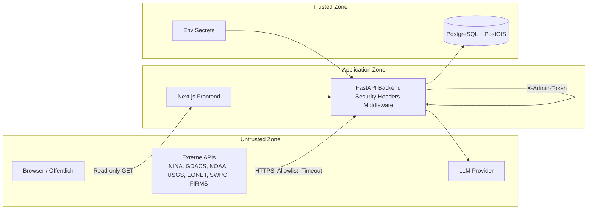

# Sicherheit — Threat Model & Maßnahmen

> **Status:** Phase 9 — Showcase-Erweiterung abgeschlossen

## Threat Model (STRIDE-lite)

| Bedrohung | Beschreibung | Priorität | Showcase-Erweiterung |
|-----------|--------------|-----------|----------------------|
| **Spoofing** | Unbefugter Zugriff auf Admin-Endpunkte | Hoch | Unverändert — `X-Admin-Token` |
| **Tampering** | Manipulation von Warnungsdaten in Transit | Mittel | HTTPS zu externen APIs; keine User-supplied URLs |
| **Repudiation** | Fehlende Audit-Logs für Admin-Aktionen | Niedrig | `IngestRun`-Historie + Observed-Event-Snapshots |
| **Information Disclosure** | DB/Secrets exponiert | Hoch | Keine Secrets im Repo; schwacher Token-Warnung beim Start |
| **Denial of Service** | Excessive Polling externer APIs oder eigene API | Mittel | Per-Source-Scheduler mit empfohlenen Intervallen; Timeouts/Size-Limits |
| **Elevation of Privilege** | Admin-Token-Leak → Schreibzugriff | Hoch | Startup-Warnung bei Default-Token; min. 32 Zeichen empfohlen |

### Showcase-spezifische Bedrohungen

| Bedrohung | Beschreibung | Mitigation |
|-----------|--------------|------------|
| **SHOWCASE vs. LIVE Verwechslung** | Demo-Daten als amtliche Warnung interpretiert | `showcase_mode` in `/health`; UI-Disclaimer; getrennte Fixture-Pfade |
| **Observed-Event-Inflation** | DB-Wachstum durch append-only Snapshots | Retention-Job (`OBSERVED_EVENTS_RETENTION_DAYS`); täglicher Cleanup |
| **Exposure-Fehlinterpretation** | GDACS/FIRMS-Exposure als exakte Bevölkerungszahl | UI-Labels „indikativ“; regelbasierte Implications mit Confidence |
| **LLM-Halluzination auf Events** | Falsche Cross-Event-Narrative | Evidence Package mit Pflicht-IDs; Pydantic-Validierung; Fallback regelbasiert |

## Trust Boundaries

### Vertrauensstufen

| Zone | Vertrauen | Behandlung |
|------|-----------|------------|
| Externe Warn-APIs | **Untrusted** | Validieren, Größenlimit, Timeout, Host-Allowlist |
| Showcase-Fixtures | **Untrusted (Demo)** | Nur bei `SHOWCASE_MODE=true`; nie als Live ausgeben |
| Warnungstexte (HTML) | **Untrusted** | Sanitizen vor Speicherung/Anzeige |
| LLM-Ausgabe | **Untrusted** | Pydantic-Validierung, kein `dangerouslySetInnerHTML` |
| Öffentliche API-Responses | **Trusted (read)** | CORS-restriktiv, Security Headers |
| Admin-Requests | **Authenticated** | Static Token |
| Datenbank | **Trusted** | Nicht öffentlich exponieren |

## Implementierte Maßnahmen (Phase 9)

### Secrets Management

- Keine Secrets im Repository (`.env` in `.gitignore`)
- `.env.example` mit Platzhaltern
- `ADMIN_TOKEN` min. 32 Zeichen, zufällig generiert
- **Startup-Warnung** wenn Default-Token (`dev-admin-token`, `change-me-in-production`) oder &lt; 32 Zeichen
- `LLM_API_KEY` nur im Backend-Container
- Frontend erhält **keine** API-Keys

### API-Sicherheit

| Maßnahme | Status | Details |
|----------|--------|---------|
| Admin-Auth | ✅ | Header `X-Admin-Token: <token>` für POST-Endpunkte |
| Public Read-Only | ✅ | Nur GET auf `/api/v1/*` (außer Admin) |
| Input-Validierung | ✅ | Pydantic für alle Query-Parameter |
| CORS | ✅ | Nur `FRONTEND_URL` erlauben |
| Security Headers | ✅ | `X-Content-Type-Options`, `X-Frame-Options`, `Referrer-Policy`, `Permissions-Policy` |
| Rate Limiting (Admin) | ⏳ | Geplant — Reverse-Proxy empfohlen |

### Externe Requests (SSRF-Schutz)

- **Keine** user-supplied URLs für HTTP-Requests
- Feste Allowlist von Quell-Hosts (NINA, GDACS, NOAA, USGS, EONET, SWPC, FIRMS)
- Timeout + Max Response Size + Retry mit Backoff

### HTML / XSS

- Warnungs-`description` und `instruction`: HTML gestrippt/sanitized
- Frontend: React text rendering + DOMPurify wo nötig
- LLM-Output: strukturiertes JSON, kein raw HTML

### Prompt-Injection / LLM

1. LLM erhält nur normalisierte, bereinigte Felder
2. `llm/sanitize.py` filtert Injection-Phrasen
3. System-Prompt: untrusted data, keine Instructions
4. Pydantic `BriefingContent`-Validierung + Fallback `rule_based`

### Infrastruktur

- DB nicht auf Host-Port in Production
- Reverse-Proxy: TLS, Admin-IP-Whitelist — siehe [deployment.md](deployment.md)
- Healthchecks ohne sensitive Payloads
- Strukturierte Logs ohne Volltext-Payloads
- CI: `pytest` + `npm run build` ohne Secrets ([`.github/workflows/ci.yml`](../.github/workflows/ci.yml))

## Bekannte Limitierungen

| Limitierung | Risiko | Mitigation (später) |
|-------------|--------|---------------------|
| Static Admin Token | Token-Leak = voller Schreibzugriff | OAuth2 / API-Key Rotation |
| Kein WAF | DDoS auf öffentliche API | Reverse-Proxy Rate Limit |
| Kein Content-Signing | Quell-Integrität nicht kryptographisch verifiziert | CAP-Signaturen (komplex) |
| Per-Source-Scheduler ohne globalen Lock | Parallele Ingests möglich | Akzeptabel — separate DB-Sessions |

## Security Checklist

- [x] `.env.example` ohne echte Werte
- [x] `ADMIN_TOKEN` Validierung/Warnung bei Startup
- [x] User-Agent für NOAA gesetzt
- [x] HTML-Sanitizer in Normalization-Pipeline
- [x] CORS auf `FRONTEND_URL` beschränkt
- [x] Admin-Endpunkte return 401 ohne Token
- [x] LLM-Prompt mit Delimiter und System-Instruktion
- [x] Pydantic-Validierung LLM-Output
- [x] Security Headers in FastAPI Middleware
- [x] CI: pytest + frontend build
- [ ] Dependabot / pip-audit in CI
